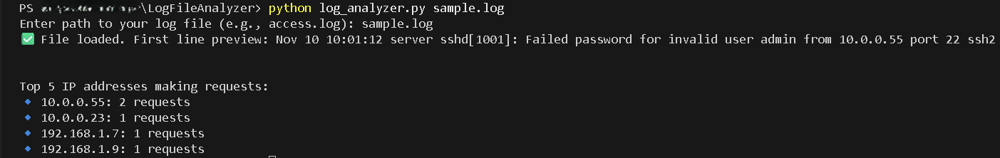

# :brain:Log File Analyzer  


---

## 📋 Description  

**Log File Analyzer** is a Python-based cybersecurity utility that parses and analyzes system log files for key security events such as failed login attempts, unauthorized access, and anomalies in network or user activity.  

It’s designed to help security analysts and IT professionals quickly detect suspicious patterns and gain insights into system behavior through automation.

---

## :gear:Features  

- 🔍 Detect repeated failed login attempts  
- 🧩 Identify anomalies or irregular user activity  
- 🕒 Timestamp and sort event occurrences  
- 📊 Generate concise summary reports  
- ⚡ Lightweight, simple command-line interface  

---

## 🚀 Usage Instructions  

### :one: Clone the Repository  

```bash
git clone https://github.com/ehudson92/log-file-analyzer.git
cd log-file-analyzer
```

### :two: Run the Script

```bash
python log_analyzer.py <path_to_log_file>
```

Example:

```bash
python log_analyzer.py /var/log/auth.log
```

### :three: Output Screenshot Examples

| Example | Description | Screenshot |
|----------|--------------|-------------|
| 1 | Alert Summary |  |

```bash
[INFO] Log File Analyzer Started...
[ALERT] Failed password for invalid user admin attempts detected.
[SUMMERY] Top 5 IP addresses making request. Analysis Completed.
```

### :balance_scale: Ethical Disclaimer

```bash
This tool is created 'Strictly For Educational and Ethical Cybersecurity research purposes.'
Do not use it on any system without proper authorization. Unauthorized use may violate computer misuse laws and regulations.
```

## :bust_in_silhouette: Author

Edward Hudson Jr.

Cybersecurity & Information Technology Graduate

#### LinkedIn <https://www.linkedin.com/in/edwardhudsonjrofficial>

#### GitHub <https://github.com/ehudson92>
